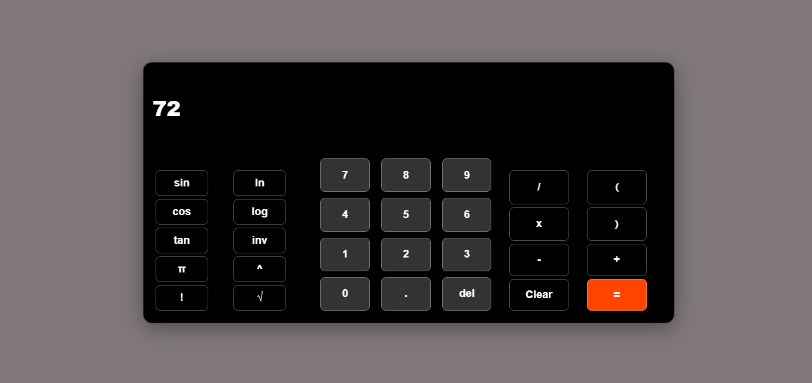

# CALCULATOR PROJECT

This is a simple calculator project created using HTML, CSS, and JavaScript. The calculator allows users to perform basic arithmetic calculations, use trigonometric functions, and a few other operators in maths.

## Features

- Basic arithmetic operations: addition, subtraction, multiplication, division
- Exponentiation (^) and factorial (!) operations
- Trigonometric functions: sin, cos, tan, and their inverses (sin⁻¹, cos⁻¹, tan⁻¹)
- Logarithmic functions: log base 10 and natural logarithm (ln)
- Square root (√) operation
- Constants: π (pi)
- Backspace (del) to delete the last entered character
- Clear (Clear) to clear the input
- Responsive design for different screen sizes

## Technologies Used

- HTML: Markup structure of the calculator
- CSS: Styling and layout of the calculator and buttons
- JavaScript: Logic for calculator operations and interactivity

## Demo

If you want to see a live demo of the calculator, you can visit [Demo Link](https://saheedatt.github.io/calculator/).

## Screenshots

## Known Issues

- I was unable to get the inverse of the trigonometry functions to work.

